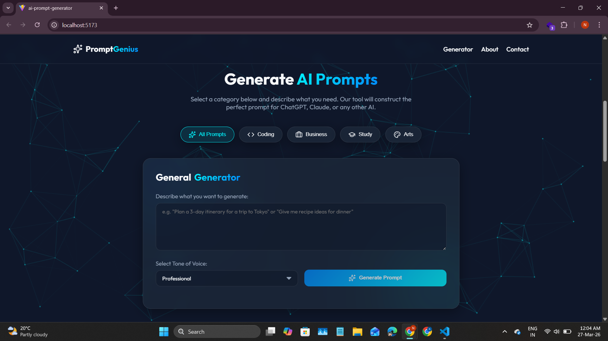
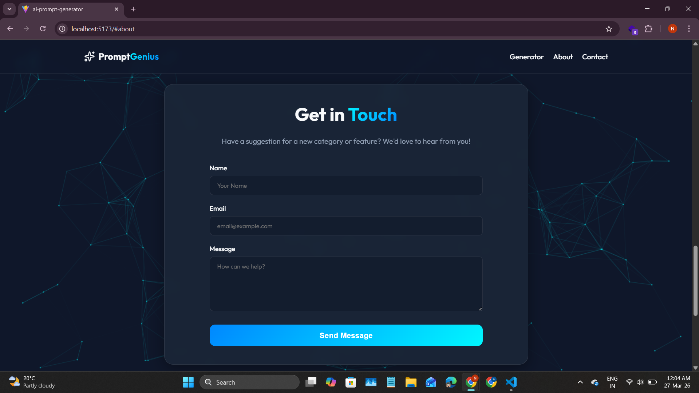
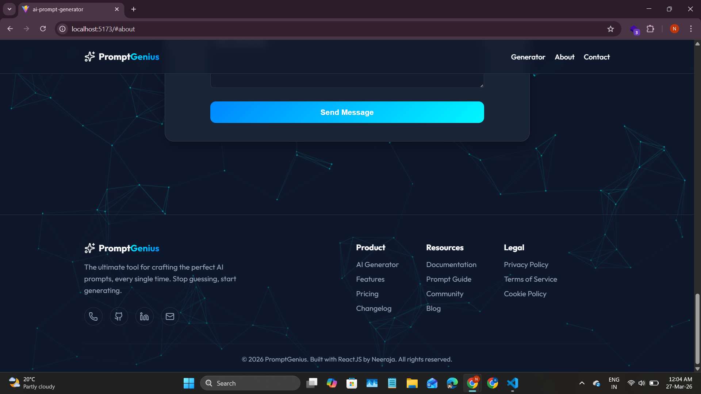

# 🚀 AI Prompt Generator

An **AI Prompt Generator** is a web-based application that helps users create structured and effective prompts for AI tools like ChatGPT and DALL·E. It simplifies prompt writing, improves output quality, and saves time.

---

## 📌 Problem Statement

Many users struggle to write clear and effective prompts for AI tools, resulting in poor or irrelevant outputs.

---

## 💡 Solution

This project generates optimized, ready-to-use prompts based on user input, helping users get better and more accurate results from AI platforms.

---

## ✨ Features

* ⚡ Dynamic prompt generation
* 🎯 User-friendly interface
* 🧠 Supports multiple use cases (content, coding, design, etc.)
* 📈 Improves AI response quality
* 🚀 Fast and responsive (built with Vite)
* 📋 Easy copy & reuse of generated prompts
* 🔧 Scalable for future enhancements

---

## 🛠️ Tech Stack

* **Frontend:** React
* **Build Tool:** Vite
* **Languages:** JavaScript, HTML, CSS
* **Package Manager:** npm

---

## 📸 Screenshots

### 🏠 Home Page


### ✍️ Prompt Generator


### 📞 Contact Page


### ℹ️ About Page


### 🔻 Footer Section

---

## 📂 Project Structure

```
ai-prompt-generator/
│
├── public/
├── src/
├── README.md
├── package.json
├── .gitignore
└── LICENSE
```

---

## ⚙️ Installation & Setup

```bash
# Clone the repository
git clone https://github.com/neeraja00/ai-prompt-generator.git

# Navigate to project folder
cd ai-prompt-generator

# Install dependencies
npm install

# Run the development server
npm run dev
```

---

## 🌐 Live Demo

👉 https://ai-prompt-generator-tau.vercel.app/

---

## 🚀 Future Improvements

* Integrate real AI APIs for advanced prompt generation
* Add more prompt categories and templates
* Improve UI with modern styling and animations
* Add user authentication and saved prompts feature

---

## 📄 License

This project is licensed under the **MIT License**.

---

## 👨‍💻 Author

**Neeraja Billa**
CSE Student | Full Stack Developer

---

## ⭐ Contribute & Support

If you like this project, give it a ⭐ on GitHub and feel free to contribute!
